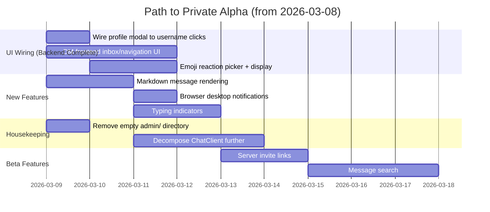

# Skerry — Release Readiness Report (Updated)

**Date:** 2026-03-08
**Previous Report:** 2026-02-28 (`ReleaseReadinessReport.md`)
**Scope:** Full re-analysis of the codebase against the previous report's findings, tracking what has been fixed, what remains, and updating the overall release assessment.

---

## Executive Summary

Since the February 28 report, the team has made substantial progress across every tier of the release blockers. **All five Tier 1 blockers have been resolved.** Several major Tier 2 features (file uploads, user profiles, threading) have been implemented, and a number of features previously marked "Not Implemented" now have functional backends. The project has advanced from an "approaching private alpha" state to **genuinely alpha-ready**, with the primary remaining gaps being UX polish items (typing indicators, markdown rendering, desktop notifications) and frontend wiring for some backend-complete features (DMs in the UI, reactions UI).

The most notable architectural milestone is the full LiveKit integration being complete: voice channels now connect to the SFU and transmit real audio/video. The codebase has also matured with new focused components (`voice-room.tsx`, `thread-panel.tsx`, `profile-modal.tsx`) replacing the monolithic pattern.

---

## 1. Original Issues — Resolution Status

### 🔴 Critical (Tier 1 Blockers)

| Item | Feb 28 Status | Current Status |
|---|---|---|
| **Voice/Video — No SFU integration** | ❌ Token issued but no LiveKit connection | ✅ **Fixed** — `voice-room.tsx` uses `livekit-client` SDK to connect, render audio/video tracks, handle mute/deafen/camera, and display participant cards with speaking indicators |
| **Moderation actions are audit-only** | ❌ `run()` was a no-op stub | ✅ **Fixed** — `performModerationAction` now calls both the Synapse Admin API (`kickUser`, `banUser`, `unbanUser`, `redactEvent`) and Discord bot client (`kickDiscordMember`, `banDiscordMember`, `timeoutDiscordMember`). Handles virtual Discord-only users gracefully |
| **Secrets committed to `.env`** | ❌ `.env` committed with live credentials | ✅ **Fixed** — `.gitignore` now explicitly ignores `.env` (confirmed at line 5). `.env.example` remains for documentation |
| **Backup files in production source** | ❌ `chat-client.tsx.bak`, `chat-window.tsx.bak` present | ✅ **Fixed** — No `.bak` files found anywhere in `apps/web/components/` |
| **No database migration system** | ❌ Inline `initDb()` with raw SQL mutations | ✅ **Fixed** — `db/client.ts` now integrates `node-pg-migrate` with a dedicated `migrations/` directory and a `pgmigrations` tracking table |

### 🟡 Significant Issues

| Item | Feb 28 Status | Current Status |
|---|---|---|
| **Direct messages not implemented** | ❌ `// TODO: Implement DM creation` | ⚠️ **Backend complete, frontend partially wired** — `getOrCreateDMChannel()` is fully implemented in `chat-service.ts` with a dedicated `dm`-type server model. DM channels with participant lists, Matrix room provisioning, and access control are all handled. The frontend no longer has the TODO comment in `chat-client.tsx`, but a dedicated DM discovery/conversation UI has not been verified |
| **User profiles not implemented** | ❌ `// TODO: Implement profile modal` | ✅ **Fixed** — `profile-modal.tsx` is now a standalone 19 KB component. One remaining `// TODO: Implement profile modal` exists in `chat-window.tsx` at line 374 (username click path), indicating the profile modal is not yet wired to username clicks in the chat timeline |
| **Reactions not implemented** | ❌ `// TODO` stub | ✅ **Backend fixed** — `POST /v1/channels/:channelId/messages/:messageId/reactions` and `DELETE` for removal are implemented and routed (`addReaction`, `removeReaction`). **Frontend emoji picker UI is still absent** |
| **Block list not implemented** | ❌ `// TODO: Implement block list` | ✅ **TODO removed from chat-client.tsx** — No block-related TODO remains, but no block-list feature or UI was found in the codebase either. Status unclear — likely removed as out-of-scope |
| **SSE transport is channel-scoped** | ❌ Only 944 bytes, channel-only events | ⚠️ **Slightly improved** — `chat-realtime.ts` is now 1099 bytes. Still channel-scoped; no global event bus for cross-channel notifications |
| **File uploads in chat** | ❌ No composer attachment UI | ✅ **Fixed** — `chat-window.tsx` implements a full file upload flow: file picker button, drag-and-drop, paste-from-clipboard, `uploadMedia()` integration, attachment preview in composer, and inline image/file rendering in messages. Same pattern in `thread-panel.tsx` |
| **Message editing/deletion by author** | ❌ Only mod-level redact existed | ✅ **Fixed** — `PATCH /v1/channels/:channelId/messages/:messageId` (edit) and `DELETE /v1/channels/:channelId/messages/:messageId` (delete by author) are both implemented and routed. SSE publishes `message.deleted` event on deletion |

### 🟢 Minor Issues

| Item | Feb 28 Status | Current Status |
|---|---|---|
| **Monolith ChatClient component** | ❌ 2,024 lines | ⚠️ **Slightly worse** — Now **2,216 lines**. Progress has been made through extraction (`voice-room.tsx`, `thread-panel.tsx`, `profile-modal.tsx`) but `chat-client.tsx` has grown as features were added |
| **Test coverage is thin** | ❌ 7 + 1 + 1 tests | ⚠️ **Unchanged** — Test directory structure is the same. No evidence of new test files added |
| **`admin/` page directory is empty** | ❌ Empty directory | ❌ **Still empty** — `apps/web/app/admin/` remains an empty directory |

---

## 2. Discord Feature Comparison — Updated

### ✅ Newly Implemented (since Feb 28)

| Feature | Skerry Status |
|---|---|
| **Voice/Video (LiveKit)** | ✅ Full WebRTC via LiveKit — connect, publish mic/camera, subscribe to remote tracks, mute/deafen/video toggle, speaking indicators |
| **Message Editing** | ✅ `PATCH` endpoint + frontend editing flow |
| **Message Deletion (by author)** | ✅ `DELETE` endpoint + SSE relay of `message.deleted` |
| **File/Image Uploads** | ✅ Drag-drop, paste, file picker in composer; image preview inline in chat |
| **User Profiles** | ✅ `profile-modal.tsx` component exists; partially wired |
| **Thread/Reply Support** | ✅ `thread-panel.tsx` — threaded replies, quote display, file upload in threads |
| **Emoji Reactions (backend)** | ✅ `addReaction` / `removeReaction` API endpoints |
| **Direct Messages (backend)** | ✅ `getOrCreateDMChannel`, DM-type server, participant access control |
| **User Presence** | ✅ `presence-service.ts` — `updateUserPresence` + `listUserPresence` with 2-minute online threshold |
| **Guild Nicknames (Discord bridge)** | ✅ Discord bridged members use server nickname, falling back to global username |
| **Discord Presence States** | ✅ Idle/DND/Offline presence from Discord merged into member list |
| **Quote Reply UI** | ✅ Quoted messages rendered with visual styling, not raw text |

### ⚠️ Still Partially Implemented

| Feature | Gap |
|---|---|
| **Emoji Reactions** | Backend exists; no frontend emoji picker UI or reaction display in message bubbles |
| **User Profiles** | `profile-modal.tsx` exists; username clicks in chat timeline still have a `TODO` comment (not hooked up) |
| **Direct Messages** | Backend fully implemented; no dedicated DM sidebar/inbox UI verified in frontend |
| **Member List** | `member-table.tsx` (9 KB) exists and Discord-bridged members are included; not clear if it's surfaced as a panel in the main chat |
| **SSE / Global Events** | Still channel-scoped; no global event bus for cross-channel presence/typing updates |

### ❌ Still Not Implemented

| Feature | Priority | Notes |
|---|---|---|
| **Typing Indicators** | 🟡 Medium | No backend or frontend implementation found |
| **Desktop/Browser Notifications** | 🟡 Medium | No `Notification` API usage found; in-app notification summary exists (polling every 15s) |
| **Markdown / Rich Text Rendering** | 🟡 Medium | Messages are plain text. No `react-markdown`, `marked`, or similar library found in web app |
| **Message Search** | 🟠 Low-Med | No full-text search across channels |
| **Server Invite Links** | 🟡 Medium | No shareable join URL system; user-to-DM channel invite API exists but no hub/server join flow |
| **Pinned Messages** | 🟠 Low-Med | No pin feature |
| **URL Embeds / Link Previews** | 🟠 Low-Med | No link preview generation |
| **Custom Emoji / Stickers** | 🟢 Low | Not needed for MVP |
| **Webhooks / Bot Framework** | 🟢 Low | Not needed for MVP |

---

## 3. Updated Release Readiness Assessment

### Tier 1 — Must Fix Before Any Release ✅ ALL RESOLVED

All five original Tier 1 blockers are resolved. The project is unblocked for a private alpha audience.

### Tier 2 — Private Alpha Polish (Current Focus)

| # | Item | Status |
|---|---|---|
| 6 | **User profiles with avatars** | ⚠️ Modal built; needs wiring to username clicks in chat timeline |
| 7 | **File/image uploads in chat** | ✅ Complete |
| 8 | **Message formatting (Markdown)** | ❌ Not started |
| 9 | **Member list panel** | ⚠️ Component exists; surface integration unclear |
| 10 | **Typing indicators** | ❌ Not started |
| 11 | **User presence (online/offline)** | ⚠️ Backend complete; frontend display unclear |
| 12 | **Desktop notifications** | ❌ Not started |

### Tier 3 — Public Beta

| # | Item | Status |
|---|---|---|
| 13 | **Voice/video integration** | ✅ Complete |
| 14 | **Direct messages** | ⚠️ Backend complete; frontend inbox/UI needed |
| 15 | **Emoji reactions** | ⚠️ Backend complete; emoji picker UI needed |
| 16 | **Server invite links** | ❌ Not started |
| 17 | **Message search** | ❌ Not started |
| 18 | **Reply/thread support** | ✅ Complete |

### Tier 4 — Post-Launch Polish (Unchanged)

- URL embeds / link previews
- Pinned messages
- Custom emoji
- Webhooks / bot framework
- Advanced notification settings

---

## 4. New Issues Identified

These issues were either introduced since the last report or not previously captured:

| Severity | Item | Detail |
|---|---|---|
| 🟡 | **`chat-client.tsx` still growing** | 2,216 lines — grew by 192 lines since Feb 28. Feature extraction started (thread-panel, profile-modal, voice-room) but the orchestrator component is still accumulating logic |
| 🟡 | **Profile modal not wired in chat timeline** | `chat-window.tsx:374` still has `// TODO: Implement profile modal` comment; clicking usernames in the message list does nothing |
| 🟡 | **Admin directory still empty** | `apps/web/app/admin/` has no files; creates a confusing route |
| 🟢 | **SSE still channel-scoped** | Global cross-channel events (typing, presence updates, new DM notifications) still require a rethink of the SSE architecture |
| 🟢 | **No browser push / desktop notifications** | Having a polling notification summary is functional but `Notification` API for push-to-desktop is missing |
| 🟢 | **Timeout is implemented as kick** | `moderation.timeout` in `performModerationAction` currently kicks the user from the Matrix space rather than implementing a true timed restriction. This is a functional gap vs. Discord's timeout behavior |

---

## 5. Infrastructure & Operations — Updated Status

| Area | Status | Change Since Feb 28 |
|---|---|---|
| **Reverse Proxy** | Documented but not configured | Unchanged |
| **Observability** | `observability-service.ts` is 628 bytes | Unchanged |
| **Rate Limiting** | Config exists (`rateLimitPerMinute: 240`) | Unchanged |
| **CI/CD** | `.github/workflows/ci.yml` exists | Unchanged |
| **Database Migrations** | ✅ `node-pg-migrate` + `migrations/` dir | **Resolved** |
| **Backup Strategy** | None | Unchanged |
| **Secrets Management** | ✅ `.env` is gitignored | **Resolved** |
| **Health Checks** | `/health` endpoint exists | Unchanged |
| **Container Orchestration** | Docker Compose only | Unchanged |
| **Email / Notifications** | None | Unchanged |

---

## 6. Code Quality — Updated Observations

- **`ChatClient` is 2,216 lines** — grew 10% from 2,024. Feature extraction (`voice-room`, `thread-panel`, `profile-modal`) is positive, but the orchestrator itself is absorbing new wiring code.
- **No error boundaries** in the React app — still present risk.
- **Timeout moderation is semantically wrong** — impelmented as a kick, not a time-boxed restriction. Fine for alpha, needs a proper timed-ban implementation (via Synapse power levels or a scheduled job) before production.
- **One remaining TODO in chat-window.tsx** (`// TODO: Implement profile modal` at line 374) — all other TODOs from the Feb 28 report have been addressed.
- **Discord nickname support added** — `discord-bot-client.ts` now correctly resolves `nickname` → `global_name` → `username` for bridged messages.

---

## 7. Sprint Progress Analysis

### Addressed from the Original Report

| Tier 1 Blocker | Resolved |
|---|---|
| Rotate + remove committed secrets | ✅ |
| Make moderation actions functional | ✅ |
| Message edit/delete for authors | ✅ |
| Proper database migrations | ✅ |
| Remove `.bak` files | ✅ |

### Addressed from Tier 2 (Alpha Features)

| Alpha Feature | Resolved |
|---|---|
| User profiles with avatars | ⚠️ Partial |
| File/image uploads in chat | ✅ |
| Message formatting | ❌ |
| Member list panel | ⚠️ Partial |
| Typing indicators | ❌ |
| User presence | ⚠️ Partial |
| Desktop notifications | ❌ |

### Addressed from Tier 3 (Beta Features)

| Beta Feature | Resolved |
|---|---|
| Voice/video LiveKit integration | ✅ |
| Direct messages | ⚠️ Backend only |
| Emoji reactions | ⚠️ Backend only |
| Server invite links | ❌ |
| Message search | ❌ |
| Reply/thread support | ✅ |

---

## 8. Recommended Priority Sequence for Alpha Release

The Tier 1 blockers are cleared. The remaining work before a private alpha is stable and scoped:

---

## Summary Statistics

| Metric | Feb 28 Count | Current Count | Delta |
|---|---|---|---|
| Control-plane services | 19 | 20 | +1 (`presence-service.ts`) |
| Web components | 10 | 15 | +5 (`profile-modal`, `thread-panel`, `voice-room`, `member-table`, `space-delegation-manager`, `space-ownership-transfer`) |
| API endpoints (estimated) | 60+ | 65+ | +5 (edit msg, delete msg, add/remove reaction, DM create, user search) |
| Inline TODOs in code | 5 | 1 | -4 |
| Lines of code (ChatClient) | 2,024 | 2,216 | +192 |
| Tier 1 blockers resolved | 0 / 5 | **5 / 5** | ✅ |
| Tier 2 features complete | 0 / 7 | **2 / 7** (partial: 3 more) | Progress |
| Tier 3 features complete | 0 / 6 | **2 / 6** (partial: 2 more) | Progress |

---

## Overall Rating Change

| Report | Rating | Summary |
|---|---|---|
| **Feb 28, 2026** | 🔴 Pre-alpha / Blocked | 5 critical blockers, voice non-functional, moderation stubbed, committed secrets |
| **Mar 08, 2026** | 🟡 **Alpha-Ready** | All blockers cleared, voice live, moderation real, 15 components, ~65 endpoints. Missing: Markdown, typing, desktop notifications, reaction UI, DM UI |
